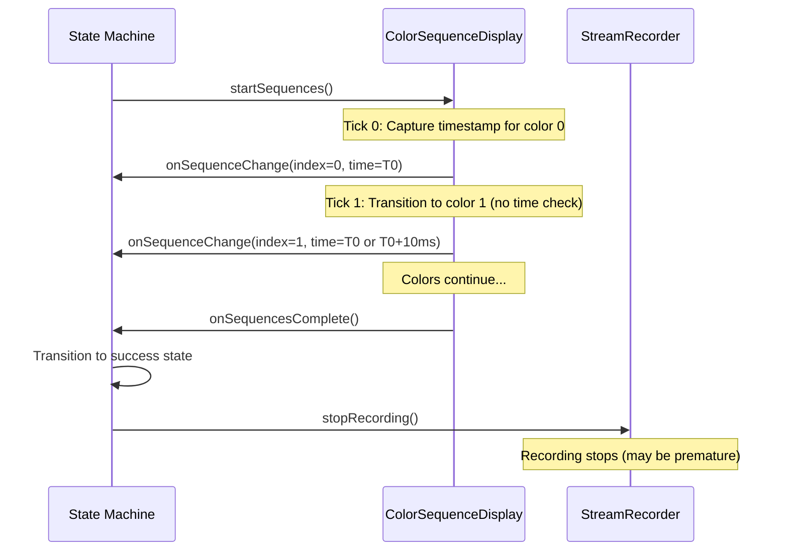
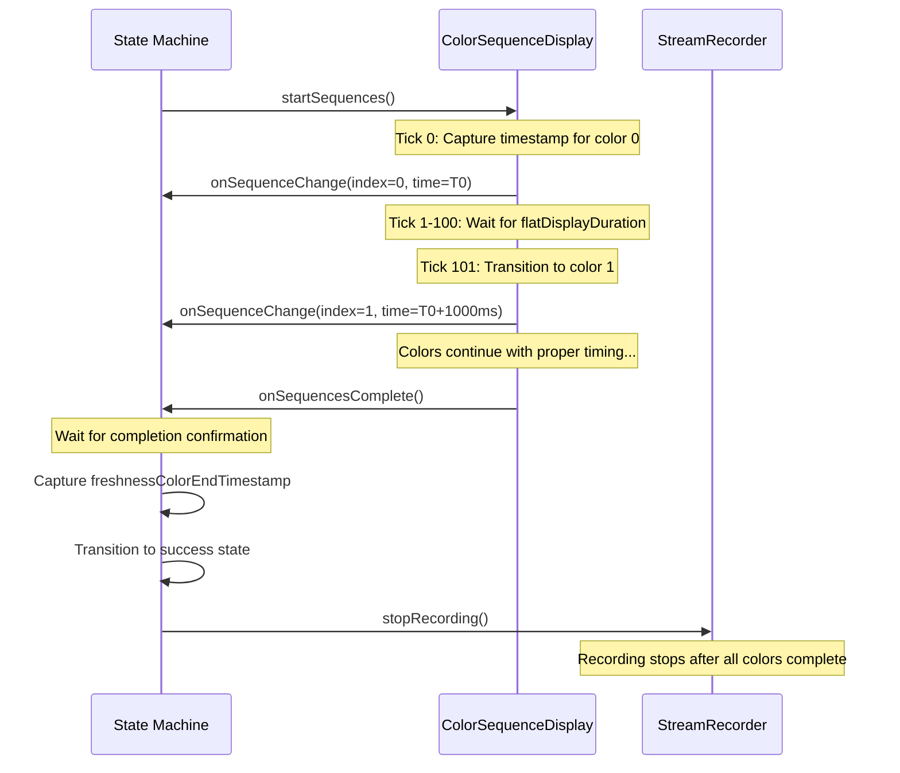
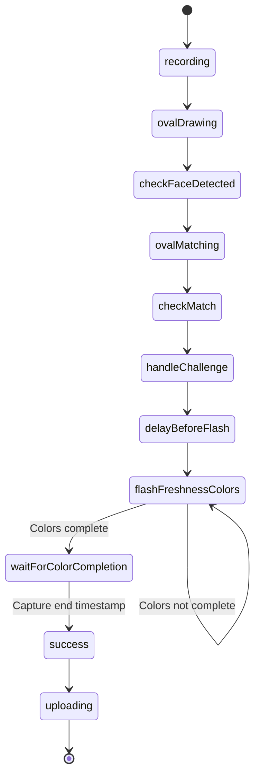

# Design Document

## Overview

This design addresses two critical issues in the Data Collection App (DCA) for facial liveness detection:

1. **Timestamp Duplication**: The first two color signals (black [0,0,0] and blue [0,0,255]) receive identical `colorStartTimestamp` values due to the timing of when timestamps are captured in the `ColorSequenceDisplay` class.

2. **Video Truncation**: Video recordings are being stopped prematurely (~5 seconds) before all color sequences complete (~8 seconds), resulting in incomplete data collection.

The root causes have been identified through code analysis:

- Timestamp duplication occurs because the first tick logic in `ColorSequenceDisplay.#startColorSequence` captures the initial timestamp but then immediately transitions to the next sequence without allowing time to pass
- Video truncation occurs because the recording is stopped when entering the 'success' state, but the color sequence display may still be in progress

## Architecture

### Component Interaction Flow

```
LivenessCameraModule
    ↓
State Machine (machine.ts)
    ↓ (flashColors service)
ColorSequenceDisplay
    ↓ (onSequenceChange callback)
createColorDisplayEvent
    ↓
StreamRecorder (dispatchStreamEvent)
```

### Key Components

1. **ColorSequenceDisplay** (`ColorSequenceDisplay.ts`)

   - Manages the iteration through color sequences
   - Fires callbacks for sequence changes with timestamps
   - Uses a 10ms tick rate (TICK_RATE constant)
   - Maintains state for current/previous sequences and color stages (Flat/Scrolling)

2. **State Machine** (`machine.ts`)

   - Orchestrates the liveness check workflow
   - Manages recording lifecycle via `startRecording` and `stopRecording` actions
   - Invokes `flashColors` service which uses ColorSequenceDisplay
   - Captures timestamps for recording start/end and color sequences

3. **StreamRecorder** (`StreamRecorder.ts`)
   - Handles MediaRecorder operations
   - Manages video chunks and recording timestamps
   - Provides `stopRecording()` method that stops the MediaRecorder

## Components and Interfaces

### ColorSequenceDisplay Changes

The `ColorSequenceDisplay` class needs modifications to ensure unique timestamps:

```typescript
// Current problematic flow:
// Tick 0: Capture timestamp for sequence 0 (black), skip transition check
// Tick 1: Immediately transition to sequence 1 (blue) with same/similar timestamp

// Proposed flow:
// Tick 0: Capture timestamp for sequence 0 (black), skip transition check
// Tick 1+: Check if enough time has passed before transitioning
```

**Key Methods to Modify:**

- `#startColorSequence()`: Fix the first tick logic to ensure proper time passage
- `#handleSequenceChange()`: Ensure timestamps are captured at the actual moment of change

### State Machine Changes

The state machine needs to ensure recording continues until all color sequences complete:

```typescript
// Current flow:
recording.flashFreshnessColors → recording.success (stops recording)

// Proposed flow:
recording.flashFreshnessColors → wait for completion → recording.success (stops recording)
```

**Key States/Actions to Modify:**

- `flashFreshnessColors` state: Ensure it waits for all sequences to complete
- `stopRecording` action: Delay execution until color display is confirmed complete
- `stopVideo` service: Ensure it captures the final timestamp after all colors are displayed

### Timestamp Capture Points

**Current Timestamp Variables (machine.ts):**

```typescript
let recordingStartTimestampActual: number;
let recordingEndTimestamp: number;
let freshnessColorStartTimestamp: number;
let freshnessColorEndTimestamp: number;
```

**Timestamp Capture Strategy:**

1. `freshnessColorStartTimestamp`: Captured when first color (index 0) starts
2. Individual color timestamps: Captured via `onSequenceChange` callback
3. `freshnessColorEndTimestamp`: Should be captured when last color completes
4. `recordingEndTimestamp`: Should be captured after all colors complete

## Data Models

### SequenceChangeParams Interface

```typescript
export interface SequenceChangeParams extends SequenceColors {
  sequenceIndex: number;
  sequenceStartTime: number; // This is the critical timestamp
}
```

### ColorSequence Interface

```typescript
export interface ColorSequence {
  color: SequenceColorValue;
  downscrollDuration: number;
  flatDisplayDuration: number;
}
```

### Recording State Context

```typescript
interface FreshnessColorAssociatedParams {
  freshnessColorEl: HTMLCanvasElement | undefined;
  freshnessColors: Array<{
    sequenceIndex: number;
    timestamp: number;
    color: SequenceColorValue;
  }>;
  freshnessColorsComplete: boolean;
}
```

## Error Handling

### Timestamp Validation

Add validation to ensure timestamps are monotonically increasing:

```typescript
function validateTimestamps(colorSignals: ColorSignal[]): boolean {
  for (let i = 1; i < colorSignals.length; i++) {
    if (colorSignals[i].timestamp <= colorSignals[i - 1].timestamp) {
      console.error(`Timestamp validation failed at index ${i}`);
      return false;
    }
  }
  return true;
}
```

### Recording Duration Validation

Add validation to ensure video duration matches expected duration:

```typescript
function validateRecordingDuration(
  expectedDuration: number,
  actualDuration: number,
  tolerance: number = 500 // ms
): boolean {
  const difference = Math.abs(expectedDuration - actualDuration);
  if (difference > tolerance) {
    console.error(
      `Recording duration mismatch: expected ${expectedDuration}ms, got ${actualDuration}ms`
    );
    return false;
  }
  return true;
}
```

## Testing Strategy

### Unit Tests

1. **ColorSequenceDisplay Tests** (`ColorSequenceDisplay.test.ts`)

   - Test that first two sequences receive different timestamps
   - Test that timestamps are monotonically increasing
   - Test that sequence transitions respect duration thresholds
   - Mock Date.now() to control time progression

2. **State Machine Tests** (`machine.test.ts`)

   - Test that recording continues until all colors complete
   - Test that `freshnessColorEndTimestamp` is captured correctly
   - Test that video recording duration matches color sequence duration
   - Mock ColorSequenceDisplay to control completion timing

3. **StreamRecorder Tests** (`StreamRecorder.test.ts`)
   - Test that stopRecording() waits for all chunks
   - Test that recording end timestamp is accurate

### Integration Tests

1. **End-to-End Color Sequence Test**

   - Start a liveness check with color sequences
   - Verify all color timestamps are unique and increasing
   - Verify video duration matches expected duration
   - Verify JSON metadata matches video content

2. **Recording Duration Test**
   - Configure color sequences with known durations
   - Verify recorded video length matches sum of durations
   - Verify no premature stopping occurs

### Manual Testing

1. Run DCA with color sequences enabled
2. Inspect generated JSON files for timestamp uniqueness
3. Verify video file duration matches JSON metadata
4. Confirm all color flashes are captured in video

## Implementation Notes

### Timing Considerations

- The `TICK_RATE` is 10ms, which means the minimum time between sequence changes should be at least 10ms
- The first color (black) typically has a `flatDisplayDuration` of 1000ms
- Subsequent colors have both `downscrollDuration` and `flatDisplayDuration`
- Total expected duration is the sum of all durations plus transition times

### Backward Compatibility

- Changes should not affect the existing liveness check flow for non-DCA use cases
- Timestamp format and structure should remain consistent with existing API
- Video recording behavior should remain the same for standard liveness checks

### Performance Impact

- Adding timestamp validation will have minimal performance impact (O(n) where n is number of colors)
- Delaying recording stop until color completion may add 1-3 seconds to total check time
- No impact on video quality or file size

## Design Decisions and Rationales

### Decision 1: Fix Timestamp Capture in ColorSequenceDisplay

**Rationale:** The root cause of timestamp duplication is in the `#startColorSequence` method where the first tick captures the timestamp but then immediately allows transition without time passage. By ensuring the first tick only captures the initial timestamp and subsequent ticks handle transitions, we guarantee unique timestamps.

**Alternative Considered:** Adding artificial delays between sequences. Rejected because it would affect the visual experience and is not a true fix.

### Decision 2: Delay Recording Stop Until Color Completion

**Rationale:** The video truncation occurs because the state machine transitions to 'success' and stops recording before all color sequences complete. By ensuring the `flashFreshnessColors` state waits for the `onSequencesComplete` callback before transitioning, we guarantee the full sequence is recorded.

**Alternative Considered:** Extending recording time by a fixed buffer. Rejected because it's not precise and could still miss colors if sequences are longer than expected.

### Decision 3: Capture End Timestamp After Color Completion

**Rationale:** The `freshnessColorEndTimestamp` should be captured when the last color actually completes, not when the recording stop is initiated. This ensures accurate metadata in the JSON output.

**Alternative Considered:** Using the recording end timestamp as a proxy. Rejected because it may not accurately reflect when colors finished displaying.

## Mermaid Diagrams

### Current Flow (Problematic)



### Proposed Flow (Fixed)



### State Machine Flow


